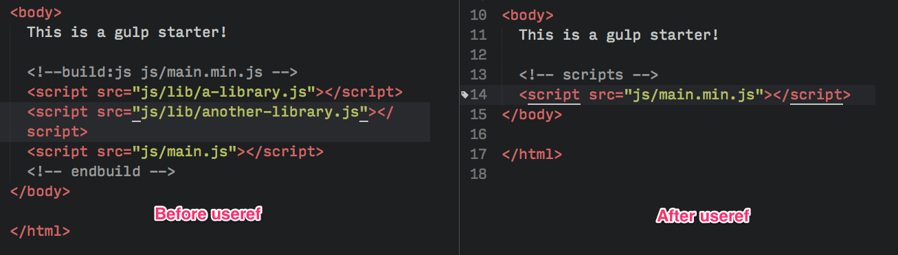

# Gulp Commands

Este repositório contem um resumo de um [artigo](https://css-tricks.com/gulp-for-beginners/) em inglês do [Zell](https://github.com/zellwk), um grande desenvolvedor que realizar alguns cursos sobre frontend, sendo que todo o crédito das informações deste repositório são dele, somente ficando a tradução a meu cargo.
Criei o repositório para realizar rápidas consultas dos principais comandos e bibliotecas informadas no artigo, alem de ser para estudar o Gulp.

## Instalando Gulp

```shell
npm install [-g] gulp
```

## Iniciando projeto com Gulp

Inicie um projeto com npm

```shell
npm init
```

Após isso, adicione o gulp ao projeto

```shell
npm install gulp --save-dev
```

## Escrevendo sua primeira tarefa com o Gulp

Primeiro é importado a biblioteca do gulp.

```javascript
var gulp = require('gulp');
```

Após isto podemos escrever uma tarefa com a seguinte sintaxe:

```javascript
gulp.task('task-name', function() {
    // Código da tarefa
});
```

Como por exemplo:

```javascript
gulp.task('hello', function() {
  console.log('Hello World');
});
```

Para realizarmos a tarefa utilizamos o comando no shell:

```shell
gulp nome-da-tarefa
# ex: gulp hello
```

Podemos realizar tarefas mais complexas como por exemplo:

```javascript
gulp.task('task-name', function () {
  return gulp.src('source-files') // Pega o arquivo do diretório com gulp.src
    .pipe(aGulpPlugin()) // Envia o arquivo através de um plugin do gulp
    .pipe(gulp.dest('destination')) // Adiciona o arquivo para o diretório de destino
});
```

* **gulp.src**: Fala para a tarefa do gulp quais arquivos usar para a tarefa;
* **gulp.dest**: Fala para o gulp onde será a saida dos arquivo depois da tarefa ser executada;

## Exemplo: processando Sass com Gulp

Com o plugin [gulp-sass](https://www.npmjs.com/package/gulp-sass) podemos compilar o Sass para CSS, para instala-lo usamos o seguinte comando:

```shell
npm install gulp-sass --save-dev
```

Após instalar o package, devemos importá-lo com o require:

```javascript
var gulp = require('gulp');
// Require do package gulp-sass
var sass = require('gulp-sass');
```

Podemos utilizar o package trocando-o **aGulpPlugin()** por **sass()** do exemplo anterior:

```javascript
gulp.task('sass', function() {
  return gulp.src('diretorio/scss/styles.scss')
    .pipe(sass()) // Usando gulp-sass
    .pipe(gulp.dest('diretorio-saida/css'))
});
```

Para testar basta rodar o comando **gulp sass** no terminal.

### Usando Globbing no Node

Globs são combinações padrões para arquivos que permitem você a adicionar mais que um arquivos ao comando **gulp.src**. É como expressões regulares, porem especificamente para file paths.

Quando você usa um glob, o computador checa o nome dos arquivos e caminhos do padrão especificado. Se o padrão existir, então o arquivo é selecionado.

Muitos workflows com Gulp tentem a somente precisar de 4 diferentes padrões glob:

* **\*.scss**: O **\*** é uma carta trunfo que corresponde a qualquer padrão no atual diretório. Neste caso, estamos verificando qualquer arquivo terminado com **.scss** no diretório do projeto.
* **\*\*/\*.scss**: Este é mais extremo que o padrão com **\*** que corresponde a qualquer arquivo terminado com **.scss** no final do nome do arquivo no diretório do projeto e em qualquer diretório filho.
* **!not-me.scss**: O **!** indica para o Gulp deve excluir do padrão de verificação, isso é útil quando é necessário excluir um arquivo da busca. Neste caso, **not-me.scss** será excluido da busca.
* **\*.+(scss|sass)**: O sinal de **+** e parenteses **()** permitem o Gulp a combinar vários padrões, com diferentes padrões separados por pipe **|**. Neste caso, o gulp irá buscar qualquer arquivo terminando com **.scss** ou **.sass** no diretório do projeto.

Seguindo está lógica, podemos mudar o padrão anterior de busca por este:

```javascript
gulp.task('sass', function() {
  return gulp.src('diretorio/scss/**/*.scss') // Pega todos os arquivos terminados com .scss em qualquer diretório filho de scss
    .pipe(sass())
    .pipe(gulp.dest('diretorio-saida/css'))
})
```

## Visualização de alterações de arquivos Sass

Gulp disponibiliza com o metodo watch que verifica se um arquivo foi salvado:

```javascript
// Gulp watch syntax
gulp.watch('arquivos-para-visualizar-alteracoes', ['lista', 'de', 'tasks']);
```

Se nós precisarmos escutar todos os arquivos Sass e rodar a tarefa **sass** sempre que um arquivo Sass for salvo, nós só precisamos trocar **arquivos-para-visualizar-alteracoes** pelo local dos arquivos sass, como por exemplo **app/scss/\*\*/\*.scss**, e **['lista', 'de', 'tasks']** pelo atual **['sass']**:

```javascript
// Gulp watch syntax
gulp.watch('app/scss/**/*.scss', ['sass']);
```

Mais frequentemente, nós iremos querer escutar mais de um tipo de arquivo de uma vez. Para realizar isto, nós podemos agrupar vários processos watch dentro de uma task **watch**:

```javascript
gulp.task('watch', function(){
  gulp.watch('app/scss/**/*.scss', ['sass']);
  // Outros watchers
})
```

Assim só será necessário rodar **gulp watch** em seu terminal para escutar as alterações dos arquivos.

## Live-realoading com Browser Sync

Browser Sync ajuda a facilitar o desenvolvimento web realizando um servidor que automaticamente faz o reload da página para você. Browser Sync tambem tem outras funcionalidades, como sincronização de ações através de vários dispositivos.

Primeiramente devemos instalar o pacote de browser sync:

```shell
npm install browser-sync --save-dev
```

Para usa-lo, devemos usar o require:

```javascript
var broswerSync = require('browser-sync').create();
```

Nós precisamos criar uma tarefa **browserSync** para habilitar o Gulp para realizar o reload usando Browser Sync. Já que estaremos rodando um servidor, nós precisamos o Browser Sync saiba onde o root do server deve estar:

```javascript
gulp.task('browserSync', function() {
  browserSync.init({
    server: {
      baseDir: 'diretorio-base'
    }
  })
});
```

Nós podemos mudar a função **task** um pouco para que o Browser Sync possa injetar novos styles CSS (no update do CSS) ao browser quando a função **sass** rodar:

```javascript
gulp.task('sass', function() {
  return gulp.src('diretorio/scss/**/*.scss')
    .pipe(sass())
    .pipe(gulp.dest('diretorio-saida/css'))
    .pipe(browserSync.reload({
      stream: true
    }))
});
```

Com isto terminamos de configurar o Browser Sync. Agora, nós temos que rodar tanto o **watch** quanto **browserSync** ao mesmo tempo para o reload em tempo real ocorrer.

Seria custoso ter que abrir duas linhas de comando e rodar tanto o **gulp browserSync** e **gulp watch** separadamente, então vamos fazer o gulp rodar ambos juntamente falando para a tarefa **watch** que **browserSync** deve estar completa antes de **watch** ser permitido de rodar.

Nós podemos fazer isto adicionando um segundo argumento a tarefa **watch**. A sintaxe para isso seria:

```javascript
gulp.task('watch', ['array', 'de', 'tarefas', 'para', 'completar','antes', 'do', 'watch'], function (){
  // ...
})
```

Em nosso caso estaremos adicionando a tarefa browserSync:

```javascript
gulp.task('watch', ['browserSync'], function (){
  gulp.watch('diretorio/scss/**/*.scss', ['sass']);
  // Outros watchers
})
```

Nós tambem queremos garantir que a tarefa **sass** rode antes de **watch** para que o CSS esteja pronto para que seja o mais recente sempre que executarmos um comando Gulp.

```javascript
gulp.task('watch', ['browserSync', 'sass'], function (){
  gulp.watch('diretorio/scss/**/*.scss', ['sass']);
  // Outros watchers
});
```

Podemos tambem adicionar o reload automático para arquivos HTML e Javascript:

```javascript
gulp.task('watch', ['browserSync', 'sass'], function (){
  gulp.watch('diretorio/scss/**/*.scss', ['sass']);
  // Faz o reload do browser sempre que salvarmos os arquivos de HTML ou JS
  gulp.watch('diretorio/*.html', browserSync.reload);
  gulp.watch('diretorio/js/**/*.js', browserSync.reload);
});
```

Após esta configuração, podemos rodar **gulp watch** na linha de comando.

## Otimizando arquivos CSS e Javascript

Desenvolvedores tem duas tarefas para realizar quando queremos otimizar os arquivos CSS e Javascript para produção: minificação e concatenação.

Um problema que desenvolvedores encontram quando automatizam este processo é que é dificil concatenar seus scripts na ordem correta.

Digamos que temos que incluir 3 tags script em nosso HTML.

```html
<body>
  <!-- other stuff -->
  <script src="js/lib/a-library.js"></script>
  <script src="js/lib/another-library.js"></script>
  <script src="js/main.js"></script>
</body>
```

Estes scripts estão localizados em dois diretórios diferentes. Isto dificulta a concatenação com plugins tradicionais como [gulp-concatenate](https://www.npmjs.com/package/gulp-concat)

Felizmente, há um plugin do gulp, [gulp-useref](https://www.npmjs.com/package/gulp-useref) que resolve este problema.

Gulp-useref concatena qualquer numero de arquivos CSS e Javascript em um arquivo olhando o comentário que inicia com "<\!--build:" e termina com "<!--endbuild-->" como na sintaxe abaixo:

```html
<!-- build:<type> <path> -->
... HTML Markup, lista de script ou link tags.
<!-- endbuild -->
```

**type** pode ser tanto **js**, **css**, ou **remove**. É melhor adicionar o **type** para o tipo de arquivo que você está tentando concatenar. Se você coloar o **type** como **remove**, o gulp irá remover todo o bloco construido sem gerar um arquivo.

**path** se refere ao diretório do arquivo gerado.

Como por exemplo, podemos gerar um arquivo javascriptem **js/main.min.js** com os seguintes arquivos:

```html
<!--build:js js/main.min.js -->
<script src="js/lib/a-library.js"></script>
<script src="js/lib/another-library.js"></script>
<script src="js/main.js"></script>
<!-- endbuild -->
```

Agora vamos configurar o gulp-usered plugin em nosso arquivo gulp. Nós precisamos instalar o plugin e usar o require:

```shell
npm install gulp-useref --save-dev
```

```javascript
var useref = require('gulp-useref');
```

Configuramos a tarefa ***useref** é similar a outras tarefas que já realizamos até agora:

```javascript
gulp.task('useref', function(){
  return gulp.src('app/*.html')
    .pipe(useref())
    .pipe(gulp.dest('dist'))
});
```

Agora quando utilizarmos o comando **useref**, o gulp irá rodar através de 3 tags scripts e concatenar eles em **dist/js/main.min.js**

O arquivo entretando, ainda não está minificado. Nós precisaremos usar o plugin [gulp-uglify](https://www.npmjs.com/package/gulp-uglify) para ajudar a minficar os arquivos Javascript. Nós tambem precisamos um segundo plugin chamado [gulp-if](https://github.com/robrich/gulp-if) para garantir que somente minificaremos arquivos javascript.

```shell
npm install gulp-uglify gulp-if --save-dev
```

```javascript
// Outros requires
var uglify = require('gulp-uglify');
var gulpIf = require('gulp-if');

gulp.task('useref', function(){
  return gulp.src('app/*.html')
    .pipe(useref())
    // Mifica somente se for um arquivo js
    .pipe(gulpIf('*.js', uglify()))
    .pipe(gulp.dest('dist'))
});
```

Agora o gulp deve minificar automaticamente o arquivo **main.min.js** sempre que rodarmos a tarefa **useref**.

Uma coisa interessante sobre o gulp-useref é que ele automaticamente troca todos os scripts dentro de **<\!--build:** e **<!--endbuild-->** para somente um arquivo javascript que aponta para **js/main.min.js**.



Podemos usar o mesmo método para concatenar qualquer arquivo CSS tambem. Nós iremos seguir o mesmo processo e adicionar o comentário **build**

```html
<!--build:css css/styles.min.css-->
<link rel="stylesheet" href="css/styles.css">
<link rel="stylesheet" href="css/another-stylesheet.css">
<!--endbuild-->
```

Nós tambem podemos minificar os arquivos CSS concatenados. Nós precisamos usar um pacote chamado [gulp-cssnano](https://www.npmjs.com/package/gulp-cssnano) para ajudar-nos a minificar.

```shell
npm install gulp-cssnano --save-dev
```

```javascript
var cssnano = require('gulp-cssnano');

gulp.task('useref', function(){
  return gulp.src('app/*.html')
    .pipe(useref())
    .pipe(gulpIf('*.js', uglify()))
    // Minifica somente se o arquivo for css
    .pipe(gulpIf('*.css', cssnano()))
    .pipe(gulp.dest('dist'))
});
```

## Otimizando imagens

Precisamos usar [gulp-imagemin](https://www.npmjs.com/package/gulp-imagemin) para ajudar-nos com a otimização das imagens.

```shell
npm install gulp-imagemin --save-dev
```

```javascript
var imagemin = require('gulp-imagemin');
```

Nós podemos minificar **png**, **jpg**, **gif** e até **svg**. Vamos criar a tarefa **images** para otimizar o processo.

```javascript
gulp.task('images', function(){
  return gulp.src('app/images/**/*.+(png|jpg|gif|svg)')
  .pipe(imagemin())
  .pipe(gulp.dest('dist/images'))
});
```

Já que temos diferentes tipos de arquivos, você pode adicionar opções ao plugin **imagemin** para customizar como cara imagem será otimizada.

Por exemplo, você pode criar Gifs entrelaçado adicionando a opção **interlaced** para **true**.

```javascript
gulp.task('images', function(){
  return gulp.src('app/images/**/*.+(png|jpg|jpeg|gif|svg)')
  .pipe(imagemin({
      // Adicionando interlaced para true
      interlaced: true
    }))
  .pipe(gulp.dest('dist/images'))
});
```

Entretanto a otimização de imagens é um processo extremamente demorado e pode ser que você não queira repeti-la a menos que seja necessário. Para realizar isto, nos podemos usar o plugin [gulp-cache](https://www.npmjs.com/package/gulp-cache).

```shell
npm install gulp-cache --save-dev
```

```javascript
var cache = require('gulp-cache');

gulp.task('images', function(){
  return gulp.src('app/images/**/*.+(png|jpg|jpeg|gif|svg)')
  // Caching images que rodam através do plugin imagemin
  .pipe(cache(imagemin({
      interlaced: true
    })))
  .pipe(gulp.dest('dist/images'))
});
```

## Copiando fontes para pasta dist

Sendo que arquivos fontes já são otimizados, nós somente precisamos move-los para pasta dist:

```javascript
gulp.task('fonts', function() {
  return gulp.src('app/fonts/**/*')
  .pipe(gulp.dest('dist/fonts'))
})
```

## Limpando os arquivos gerados automaticamente

Já que estamos gerando arquivos automaticamente, nós queremos garantir que os arquivos que não serão mais usados não permaneçam sem nós sabermos.

Nós teremos que instalar o plugin [del](https://www.npmjs.com/package/del) para ajudar-nos a realizar a limpeza.

```shell
npm install del --save-dev
```

```javascript
var del = require('del');
```

O plugin **del** recebe um array de nós globs nos quais falam qual serão os diretórios a excluir.

```javascript
gulp.task('clean:dist', function() {
  return del.sync('dist');
})
```

OBS: Nós não precisamos nos preocupar por deletar a pasta **dist/images** porque o gulp-cache já armazenou o cache das imagens.

Para limpar o cache, você pode criar uma tarefa separada chamada **cache:clear**

```javascript
gulp.task('cache:clear', function (callback) {
  return cache.clearAll(callback)
})
```

## Combinando tarefas gulp

Para realizar todas as tarefas em conjunto, precisamos de um novo plugin para realizar as tarefas sequencialmente chamado [run-sequence](https://www.npmjs.com/package/run-sequence)

```shell
npm install run-sequence --save-dev
```

A sua sintaxe ficaria assim:

```javascript
var runSequence = require('run-sequence');

gulp.task('task-name', function(callback) {
  runSequence('task-one', 'task-two', 'task-three', callback);
});
```

Para realizar algumas tarefas simultaneamente pode-se colocar elas em um array em conjunto:

```javascript
gulp.task('task-name', function(callback) {
  runSequence('task-one', ['tasks','dois','roda','em','paralelo'], 'task-three', callback);
});
```

Então nossa tarefa ficaria assim:

```javascript
gulp.task('build', function (callback) {
  runSequence('clean:dist',
    ['sass', 'useref', 'images', 'fonts'],
    callback
  )
})
```

```javascript
gulp.task('default', function (callback) {
  runSequence(['sass','browserSync', 'watch'],
    callback
  )
})
```

OBS: Utiliza-se o nome **task** para que assim precise somente rodar o comando **gulp** na linha de comando para ativá-la.

## Plugins extras

### Para desenvolvimento

* [Autoprefixer](https://www.npmjs.com/package/gulp-autoprefixer): Adicionar prefixos (famoso vendor) ao código CSS para dar suporte a navegadores antigos que aceitam esse recurso;
* [Sourcemaps](https://www.npmjs.com/package/gulp-sourcemaps): Usado para realizar debugging;
* [Sprity](https://www.npmjs.com/package/sprity): Usado para criar sprites;
* [Gulp changed](https://www.npmjs.com/package/gulp-changed): Compilar somente arquivos que foram alterados;
* [Babel](https://www.npmjs.com/package/gulp-babel) ou [Traceur](https://www.npmjs.com/package/gulp-traceur): Transpilar ES6+;
* [Browserify](http://browserify.org/), [Webpack](https://github.com/webpack/webpack) ou [Jspm](https://github.com/jspm): Modularização de arquivos javascript;
* [Handlebars](https://www.npmjs.com/package/gulp-handlebars) ou [Swig](https://www.npmjs.com/package/gulp-swig): Modularização do HTML;
* [Require dir](https://www.npmjs.com/package/require-directory): Separar arquivos gulp para arquivos menores;
* [Gulp modernizr](https://www.npmjs.com/package/gulp-modernizr): Gerar o script Modernizr automaticamente.

### Para otimização

* [unCSS](https://www.npmjs.com/package/gulp-uncss): Removendo CSS não usado;
* [CSSO](https://www.npmjs.com/package/gulp-csso): Mais ppções de otimização de CSS;
* [Critical](https://www.npmjs.com/package/critical): Gerando CSS inline para desempenho.

### Outros

* [Gulp Jasmine](https://www.npmjs.com/package/gulp-jasmine): Usado para adicionar teste unitário com Jasmine;
* [Gulp Rync](https://www.npmjs.com/package/gulp-rsync): Usado para realizar o deploy de seu diretório **dist** para o servidor de produção automaticamente.

## Extras

Para achar mais plugins e artigos sobre o Gulp, pode-se utilizar o repositório [Awesome Gulp](https://github.com/alferov/awesome-gulp).
